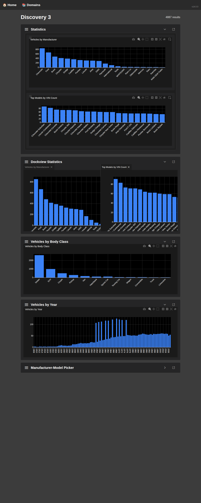
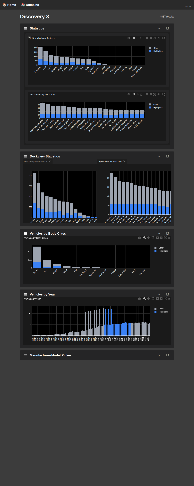
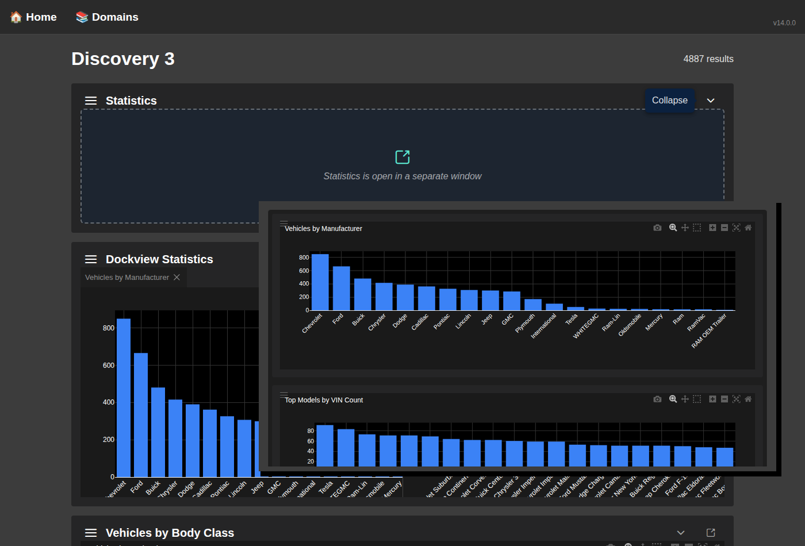
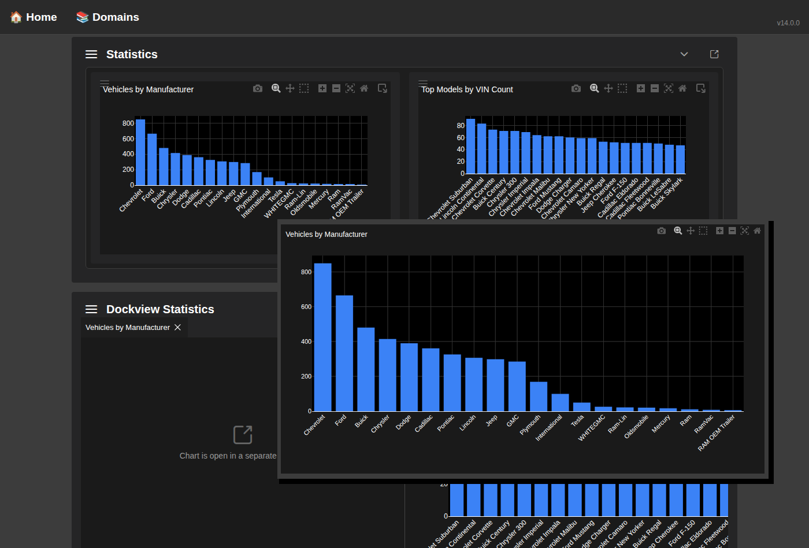

<style>
  .page-break { page-break-after: always; }
  img { max-width: 100%; height: auto; }
  h1, h2, h3 { page-break-after: avoid; }
  img { page-break-before: avoid; }
</style>

**To:** OT Team
**From:** Keith Collins
**Date:** January 2025

---

I wanted to run something by you that I think could solve a few headaches we've been dealing with.

## The Problem

GoldenLayout is blocking us. Here's where we're at:

- **We're stuck on Angular 14.** GoldenLayout hasn't been properly maintained, and its Angular integration is broken on anything newer. Every time we look at upgrading, this is the blocker.
- **The library is basically abandoned.** Last meaningful update was years ago. We're accumulating workarounds instead of getting fixes upstream.

We've been living with this, but it's only going to get worse.

## What I'm Proposing

Replace GoldenLayout with **Dockview** for our panel layout and pop-out functionality.

I've already done a proof-of-concept on the Discover3 page. Here's what it looks like:

<div class="page-break"></div>

### Basic Layout



The charts render side-by-side in dockview panels. Users can drag to resize, rearrange, or tab panels together - same capabilities as GoldenLayout, but with a library that's actually maintained.

<div class="page-break"></div>

### With Highlights Active



The highlight feature (showing a subset of data visually emphasized) works correctly through dockview. All the URL-first state management flows through properly.

<div class="page-break"></div>

### Pop-out Windows



Pop-outs work. When you pop a panel out, the main window shows a placeholder, and the pop-out gets the data via BroadcastChannel - exactly like before, but using our own PopOutManagerService instead of GoldenLayout's buggy implementation.

<div class="page-break"></div>

### Individual Chart Pop-out (from Dockview)



You can pop out individual charts from within the dockview container. Each gets a unique panel ID so there's no collision between "the manufacturer chart in dockview" and "the manufacturer chart in the statistics panel."

<div class="page-break"></div>

## Why Dockview?

- **Actively maintained.** Regular releases, responsive maintainer.
- **Modern Angular support.** Works with current Angular versions. No more upgrade blocker.
- **Vanilla JS core.** We use `dockview-core` directly, not a framework-specific wrapper. This means we're not at the mercy of someone maintaining an Angular binding.
- **Similar API concepts.** Panels, groups, drag-drop, serialization - the mental model is close enough to GoldenLayout that the migration path isn't crazy.

## What This Enables

Once GoldenLayout is out:

1. **Angular upgrade.** We can finally move past Angular 14. That unblocks a lot of other improvements.
2. **Cleaner pop-out code.** The proposed custom PopOutManagerService handles cross-window communication better than GoldenLayout did. With dockview, we just disable its built-in popout (`disableFloatingGroups: true`) and use this proven approach.
3. **Better data visibility.** The side-by-side chart layout with highlights gives users a cleaner view of their data subsets.

## Level of Effort

This is not a quick project. I'm estimating **multiple weeks** to do it right:

- **Phase 1:** Create Data Domain pages for new phenomena (done as POC)
- **Phase 2:** Migrate existing Data Domains
- **Phase 3:** Migrate any other GoldenLayout usages
- **Phase 4:** Remove GoldenLayout dependency entirely
- **Phase 5:** Angular upgrade

I'd want to do this incrementally - one page at a time - so we're not doing a big migration.

## What I Need

- Sign-off to proceed with the phased migration
- Some runway in the planning to make progress on this alongside feature work

Happy to walk through the POC or answer questions. Let me know what you think.

<div class="page-break"></div>

# Appendix A: Technical Architecture

## URL-First Architecture Deep Dive

The following section provides a comprehensive technical overview of the service architecture that supports this implementation.

---

## Core Principle

> **URL is the single source of truth.** State flows from URL → Service → Components. Components never directly modify state; they request updates that flow through URL changes.

```
┌─────────────────────────────────────────────────────────────────────┐
│                         DATA FLOW                                    │
│                                                                      │
│   User Action                                                        │
│        ↓                                                             │
│   Component calls updateFilters()                                    │
│        ↓                                                             │
│   UrlStateService.setParams() ──→ URL Updates (browser bar)         │
│        ↓                                                             │
│   UrlStateService emits new params (Observable)                      │
│        ↓                                                             │
│   ResourceManagementService receives params                          │
│        ├── filterMapper.fromUrlParams() → Filter object              │
│        └── extractHighlights() → h_* params                          │
│        ↓                                                             │
│   apiAdapter.fetchData(filters, highlights)                          │
│        ↓                                                             │
│   API Response                                                       │
│        ↓                                                             │
│   stateSubject.next({ results, statistics, ... })                    │
│        ↓                                                             │
│   Components subscribe: filters$, results$, loading$, statistics$    │
└─────────────────────────────────────────────────────────────────────┘
```

---

## Service Architecture

### Layer 1: URL State Foundation

#### UrlStateService
**Location**: `frontend/src/framework/services/url-state.service.ts`
**Scope**: Root singleton (`providedIn: 'root'`)

Watches browser URL and emits changes as Observable stream.

```typescript
// Key API
watchParams<T>(): Observable<T>     // Subscribe to URL changes
setParams(partial): Promise         // Update URL (triggers navigation)
getParams<T>(): T                   // Snapshot of current params
```

**Critical Implementation Detail**: Uses `Router.events` (not `ActivatedRoute.queryParams`) because as a root singleton, child route query params wouldn't propagate through `ActivatedRoute`.

---

### Layer 2: State Orchestration

#### ResourceManagementService
**Location**: `frontend/src/framework/services/resource-management.service.ts`
**Scope**: Component-level injection (new instance per component)

Coordinates URL changes → filter parsing → API calls → state updates.

```typescript
// Generic type parameters - domain agnostic
class ResourceManagementService<TFilters, TData, TStatistics>

// Observable streams for components
state$: Observable<ResourceState>
filters$: Observable<TFilters>
results$: Observable<TData[]>
loading$: Observable<boolean>
statistics$: Observable<TStatistics>
highlights$: Observable<any>
```

**The URL-First Pattern**:
```typescript
updateFilters(partial: Partial<TFilters>): void {
  // 1. Merge with current filters
  const merged = { ...currentFilters, ...partial };

  // 2. Convert to URL params via domain mapper
  const urlParams = this.config.filterMapper.toUrlParams(merged);

  // 3. Update URL (NOT state directly)
  this.urlState.setParams(urlParams);

  // State update happens via watchUrlChanges() reacting to URL change
}
```

**Pop-out Awareness**: Automatically disables API calls in pop-out windows:
```typescript
autoFetch: isPopOut ? false : !this.popOutContext.isInPopOut()
```

---

### Layer 3: Request Coordination

#### RequestCoordinatorService
**Location**: `frontend/src/framework/services/request-coordinator.service.ts`
**Scope**: Root singleton

Three-layer request processing:

```
execute(requestKey, requestFn)
     ↓
Layer 1: Cache Check (TTL-based, default 30s)
     ↓ (cache miss)
Layer 2: In-Flight Deduplication (same key = same Observable)
     ↓ (not already pending)
Layer 3: HTTP Request + Retry (exponential backoff)
     ↓
Cache response + return
```

**Why This Matters**: Same URL = same cache key = same data. Prevents request spam during rapid filter changes.

---

### Layer 4: Cross-Window Communication

#### PopOutContextService
**Location**: `frontend/src/framework/services/popout-context.service.ts`
**Scope**: Root singleton

Manages BroadcastChannel communication between main window and pop-outs.

```
Main Window                              Pop-out Window
     │                                        │
     │  BroadcastChannel('panel-{id}')        │
     │ ──────────────────────────────────────→│
     │        STATE_UPDATE message            │
     │                                        ↓
     │                           syncStateFromExternal(state)
     │                                        │
     │←────────────────────────────────────── │
     │         CHART_CLICK message            │
```

**Message Types** (`PopOutMessageType`):

- `PANEL_READY` - Pop-out initialized, ready for state
- `STATE_UPDATE` - Full state sync from main window
- `URL_PARAMS_CHANGED` - URL changed in main window
- `CHART_CLICK` - User clicked chart in pop-out
- `PICKER_SELECTION_CHANGE` - Selection changed in pop-out

---

## Domain Configuration Pattern

The framework is **100% domain-agnostic**. All domain specifics come from configuration.

### DomainConfig Interface
**Location**: `frontend/src/framework/models/domain-config.interface.ts`

```typescript
interface DomainConfig<TFilters, TData, TStatistics> {
  // Identity
  domainName: string;           // 'automobile'
  domainLabel: string;          // 'Automobile Discovery'
  apiBaseUrl: string;           // 'http://api.example.com/v1'

  // URL-First Adapters (THE CORE)
  urlMapper: IFilterUrlMapper<TFilters>;      // Bidirectional URL ↔ filters
  apiAdapter: IApiAdapter<TFilters, TData>;   // Fetch data from API
  cacheKeyBuilder: ICacheKeyBuilder;          // Generate cache keys

  // UI Configuration
  tableConfig: TableConfig<TData>;
  pickers: PickerConfig[];
  charts: ChartConfig[];
  filters: FilterDefinition[];
  queryControlFilters: FilterDefinition[];
  highlightFilters?: FilterDefinition[];      // h_* param filters

  // Feature Flags
  features: {
    highlights: boolean;    // Enable h_* URL params
    popOuts: boolean;       // Enable pop-out windows
    rowExpansion: boolean;  // Enable table row expansion
  }
}
```

---

## Highlights System (h_* Parameters)

Highlights enable visual emphasis of data subsets without changing the result count.

### URL Format
```
/discover?manufacturer=Ford&h_year=2020
           ↑ filter (limits results)  ↑ highlight (visual only)
```

### Data Flow
```
URL: ?manufacturer=Ford&h_year=2020
     ↓
extractHighlights() → { year: '2020' }
     ↓
apiAdapter.fetchData(filters, highlights)
     ↓
API call: /vehicles?manufacturer=Ford&h_yearMin=2020&h_yearMax=2020
     ↓
Backend returns segmented statistics:
{
  byYear: {
    2019: { total: 50, highlighted: 0 },
    2020: { total: 75, highlighted: 75 },  ← all highlighted
    2021: { total: 60, highlighted: 0 }
  }
}
     ↓
Charts render with highlight bar stacked on base bar
```

---

## File Structure

```
frontend/src/
├── framework/                      # Domain-agnostic (NO domain terms)
│   ├── services/
│   │   ├── url-state.service.ts           # URL watching
│   │   ├── resource-management.service.ts # State orchestration
│   │   ├── request-coordinator.service.ts # Caching/dedup
│   │   ├── popout-context.service.ts      # Cross-window comms
│   │   ├── popout-manager.service.ts      # Pop-out lifecycle
│   │   └── api.service.ts                 # HTTP wrapper
│   ├── models/
│   │   ├── domain-config.interface.ts     # Configuration schema
│   │   ├── resource-management.interface.ts # Adapter contracts
│   │   ├── popout.interface.ts            # Message types
│   │   └── ...
│   └── components/                 # Thin wrappers using PrimeNG
│
└── domain-config/                  # Domain-specific implementations
    └── automobile/
        ├── adapters/
        │   ├── automobile-url-mapper.ts      # IFilterUrlMapper impl
        │   ├── automobile-api.adapter.ts     # IApiAdapter impl
        │   └── automobile-cache-key-builder.ts
        ├── models/
        │   ├── automobile.filters.ts         # AutoSearchFilters
        │   ├── automobile.data.ts            # VehicleResult
        │   └── automobile.statistics.ts      # VehicleStatistics
        ├── configs/
        │   ├── automobile.picker-configs.ts
        │   ├── automobile.chart-configs.ts
        │   └── automobile.highlight-filters.ts
        ├── chart-sources/
        │   ├── year-chart-source.ts
        │   └── manufacturer-chart-source.ts
        └── automobile.domain-config.ts       # Wires everything together
```

---

## Architectural Rules

### DO
- Always update state via `urlState.setParams()` or `updateFilters()`
- Subscribe to Observable streams (`filters$`, `results$`) for reactive updates
- Include highlights in cache keys (different highlights = different cache entry)
- Use domain config for all domain-specific behavior

### DON'T
- Never call `router.navigate()` directly - bypasses URL-First pattern
- Never mutate state directly - always go through service methods
- Never put domain-specific code in framework layer
- Never fetch data directly in pop-out windows - receive via BroadcastChannel

---

## Quick Reference: Adding a New Filter

1. **Add to filter model** (`automobile.filters.ts`):
   ```typescript
   export class AutoSearchFilters {
     newField?: string;
   }
   ```

2. **Add URL mapping** (`automobile-url-mapper.ts`):
   ```typescript
   // In toUrlParams()
   if (filters.newField) params['newField'] = filters.newField;

   // In fromUrlParams()
   if (params['newField']) filters.newField = params['newField'];
   ```

3. **Add to API adapter** (`automobile-api.adapter.ts`):
   ```typescript
   if (filters.newField) params['newField'] = filters.newField;
   ```

4. **Add UI control** (query-control-filters or filter-definitions config)

The URL-First architecture ensures the filter automatically:

- Persists in browser history
- Is shareable via URL
- Syncs across pop-out windows
- Survives page refresh
